# Haridas Satheesh

### Systems • Innovation • Enterprise AI • Automation • Analytics • Climate-Tech • IoT • Applied R&D

I build and explore systems that turn fragmented signals into **better decisions, measurable action, and continuous improvement**.

My work spans enterprise transformation, EPMO, Microsoft Power Platform, AI agents, predictive intelligence, decision systems, personal intelligence software, thermal-comfort R&D, hardware sensing, health research, and sustainability.

A recurring pattern across my projects is:

> **Observe → structure → connect → predict → decide → act → measure → improve**

This repository is my **public project portfolio**. It separates implemented work from prototypes, research, architecture concepts, and experiments so that maturity is always clear.

---

## Visual portfolio map

```mermaid
flowchart TD
    A["Haridas Satheesh<br/>Systems & Innovation"] --> B["Enterprise AI & Governance"]
    A --> C["Climate-Tech & Thermal Systems"]
    A --> D["Retail Prediction & Decision Intelligence"]
    A --> E["Personal Intelligence Software"]
    A --> F["Hardware & IoT"]
    A --> G["Health & Human Performance"]
    A --> H["Sustainability & Social Impact"]
    A --> I["Professional Delivery Systems"]

    B --> B1["CORTEX"]
    B --> B2["EDNS / ECOS"]
    B --> B3["AI Meeting Brain"]
    B --> B4["Core PM System FY26"]

    C --> C1["Adaptive Non-AC Personal Cooling"]
    C --> C2["THOS / Atmospheric Habitat"]
    C --> C3["Comfort Persistence Models"]

    D --> D1["Demand Opportunity Radar"]
    D --> D2["Probabilistic Forecasting"]
    D --> D3["Stockout-adjusted Demand"]

    E --> E1["Companion Intelligence — Life OS"]
    E --> E2["Spider Execution Engine"]
    E --> E3["Evidence & Decision Systems"]

    F --> F1["Raspberry Pi / ESP32-S3"]
    F --> F2["Environmental Sensing"]
    F --> F3["Thermal Imaging"]

    G --> G1["Joint & Tissue Resilience"]
    G --> G2["12-week Protocol"]
    G --> G3["Readiness & Recovery Systems"]

    H --> H1["VermiCare"]
    H --> H2["AI Soil Health Monitor"]

    I --> I1["EPMO Automation"]
    I --> I2["LLM QA Operations"]
    I --> I3["Workflow & Analytics Delivery"]
```

➡️ [Open the detailed system map](diagrams/portfolio-system-map.md)

---

## Flagship case studies

| Case study | Domain | Maturity |
|---|---|---|
| [**CORTEX — Governance Intelligence Architecture**](case-studies/cortex-governance-intelligence.md) | Enterprise AI / EPMO | Architecture / R&D |
| [**Adaptive Non-AC Personal Cooling System**](case-studies/adaptive-personal-cooling.md) | Climate-Tech / Thermal Systems | Prototype / R&D |
| [**Companion Intelligence — Life OS**](case-studies/companion-intelligence-life-os.md) | Personal AI / Software Architecture | In Progress |
| [**Retail Demand Intelligence**](case-studies/retail-demand-intelligence.md) | Predictive Analytics / Retail | Research / Architecture |
| [**EPMO Microsoft 365 Automation Portfolio**](case-studies/epmo-automation-portfolio.md) | Enterprise Automation / Governance | Implemented / In Progress |

➡️ [View all flagship case studies](case-studies/README.md)

---

## Portfolio

### Enterprise AI, EPMO & Governance
CORTEX, governance memory, decision lineage, operational digital twins, meeting intelligence, project nervous systems, Microsoft-native PM architecture, RAID intelligence and AI-enabled governance.

➡️ [Explore Enterprise AI & Governance](projects/enterprise-ai-governance.md)  
➡️ [Architecture diagram](diagrams/cortex-governance-flow.md)

### Climate-Tech & Personal Cooling
A family of thermal-comfort concepts investigating whether a person can be cooled efficiently without refrigerating an entire room.

➡️ [Explore Climate-Tech & Cooling](projects/climate-tech-cooling.md)  
➡️ [Cooling architecture diagram](diagrams/adaptive-cooling-flow.md)

### Retail Prediction & Decision Intelligence
Demand Opportunity Radar, probabilistic forecasting, stockout-adjusted demand, feature engineering, model tournaments and outcome-driven retail experimentation.

➡️ [Explore Retail Intelligence](projects/retail-intelligence.md)  
➡️ [Decision loop diagram](diagrams/retail-decision-loop.md)

### Companion Intelligence — Life OS
A private long-term software project for evidence-based personal decision support, bounded execution, privacy, memory and learning loops.

➡️ [Explore Companion Intelligence](projects/companion-intelligence.md)  
➡️ [Life OS architecture diagram](diagrams/companion-life-os-architecture.md)

### Hardware & IoT
Raspberry Pi, ESP32-S3, environmental sensing, thermal imaging, instrumentation, soil-health monitoring and conversational-device experiments.

➡️ [Explore Hardware & IoT](projects/hardware-iot.md)

### Health & Performance Research
Structured research into joints, connective tissue, training, recovery, readiness, mobility and long-term physical resilience.

➡️ [Explore Health & Performance](projects/health-performance.md)

### Sustainability & Social Impact
VermiCare, soil-health sensing and social-impact work.

➡️ [Explore Sustainability](projects/sustainability.md)

### Professional Delivery Systems
High-level descriptions of enterprise systems and delivery work across EPMO, workflow automation, analytics, LLM operations and transformation.

➡️ [Explore Professional Delivery](projects/professional-delivery.md)

### Career & Growth Systems
Career OS, global opportunity research, freelance opportunity management and repeatable professional-growth workflows.

➡️ [Explore Career & Growth Systems](projects/career-growth-systems.md)

### Venture & Product Explorations
Startup theses, market tests, rejected ideas and the reasoning used to decide what **not** to build.

➡️ [Explore Venture Experiments](projects/venture-explorations.md)

### Creative & Knowledge Transformation
Writing and knowledge-translation work.

➡️ [Explore Creative Work](projects/creative-knowledge.md)

---

## Master index

➡️ **[Complete Project Index](PROJECT_INDEX.md)**  
➡️ **[Status & Evidence Rules](STATUS_AND_EVIDENCE.md)**

---

## Core capabilities

- Enterprise transformation and EPMO systems
- Power Automate, Power Apps, SharePoint, Microsoft Lists and Power BI
- AI agents and workflow orchestration
- Governance, RAID and portfolio intelligence
- Predictive analytics and experimentation
- Systems architecture and feedback-loop design
- Hardware / IoT prototyping
- Research synthesis and protocol design
- Cross-functional program leadership
- Product and innovation discovery

---

## Portfolio principles

- **No concept is presented as production deployment.**
- **No employer or client confidential information is published.**
- **No proprietary datasets, source code, credentials or internal documents are exposed.**
- **Maturity and evidence are stated explicitly.**
- **Ideas that failed market or feasibility checks remain documented because learning matters.**

---

## Direction

I am most interested in work where **innovation, program leadership, AI, automation, analytics, governance and systems thinking converge**—especially problems that can become reusable capabilities at global scale.
