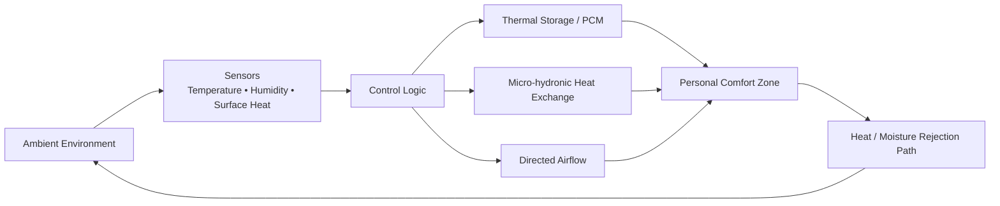

# Case Study — Adaptive Non-AC Personal Cooling System

**Domain:** Climate-Tech / Thermal Comfort / Hardware  
**Status:** Prototype / Documented R&D

## Problem

Conventional air conditioning cools a large volume of air even when only one person needs thermal comfort.

The starting question was:

> **Can the person be cooled instead of the entire room?**

## Evolution of the idea

The first design considered chilled water circulated through cooling media. The project then evolved into a localized microclimate system using multiple thermal mechanisms rather than trying to imitate a standard AC.

## Design principles explored

- localized rather than whole-room cooling,
- dry comfort air,
- separate heat/moisture rejection path,
- PCM thermal buffering,
- directed or laminar airflow,
- micro-hydronic exchange,
- radiant heat suppression,
- dew-point and condensation protection,
- adaptive sensor control.

## Why the project became interesting

The project stopped being “a better air cooler.”

It became a thermal-systems problem:

> **How little energy and conditioned air are required to maintain human comfort around a single person?**

That led to concept families including:
- Localized Dry-Core Cooling Pod,
- Comfort Halo / Thermal Bubble,
- Adaptive Microclimate Platform,
- THOS,
- Atmospheric Habitat concepts,
- Comfort Persistence Simulation.

## What is real today

The system has progressed through architecture, component research, thermal-control concepts and prototype planning.

It is not represented as a commercial product or validated replacement for AC.

## Key technical risks

- humidity management,
- heat rejection,
- condensation,
- thermal storage duration,
- acoustic comfort,
- power density,
- cost,
- user-perceived comfort versus measured temperature.

## Next validation step

A controlled bench prototype should answer only one question:

> **Can a localized dry-air comfort zone create a meaningful perceived-temperature improvement at materially lower energy than whole-room conditioning?**

Measurements should include:
- inlet/outlet temperature,
- relative humidity,
- airflow,
- surface temperature,
- electrical power,
- comfort duration,
- condensation events.
