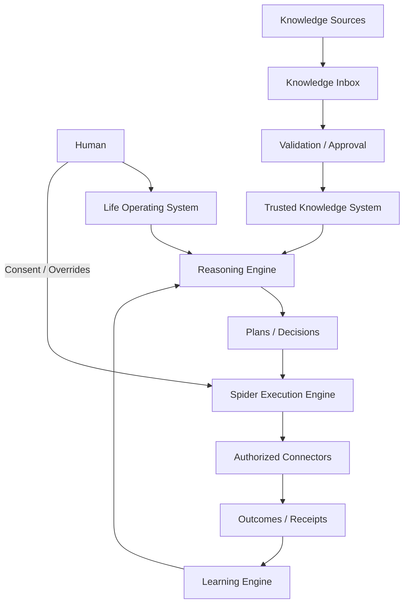

# Case Study — Companion Intelligence: Life OS

**Domain:** Personal AI / Software Architecture / Decision Support  
**Status:** In Progress  
**Implementation repository:** Private

## Problem

Personal information is usually fragmented across:
- notes,
- calendars,
- documents,
- health data,
- conversations,
- goals,
- decisions,
- reminders,
- external systems.

Most assistants can retrieve information, but a long-term personal system also needs to answer:

- What evidence is trusted?
- What changed?
- Which previous decision should be superseded?
- What can an agent execute?
- What requires explicit consent?
- How should uncertainty be represented?

## Architecture

## Non-negotiable design principles

- human autonomy over automation,
- privacy and security by design,
- explicit consent for consequential actions,
- evidence over assumptions,
- transparent uncertainty,
- modular boundaries,
- auditable execution,
- no covert persuasion or dark patterns.

## Engineering work represented in the project

- Knowledge Inbox,
- explicit claim approval,
- evidence conflict detection,
- explicit supersession,
- decision versioning,
- read-only knowledge boundaries,
- Google Drive knowledge-adapter work,
- encrypted local-storage research,
- atomic record/receipt transactions,
- local key-custody research,
- cross-platform packaging,
- AI architecture-review workflows.

## Why this project matters

The project is less about building another chatbot and more about:

> **How should a long-term personal intelligence system behave when memory, evidence, action and human agency all matter?**

## What is real today

This is an active private engineering repository with architecture, governance, backend/frontend/integration structure and ongoing implementation work.

## What remains difficult

- safe long-term memory,
- confidence and uncertainty,
- conflict resolution,
- permission boundaries,
- reversible actions,
- human-readable audit history,
- avoiding over-automation.

## Next validation step

Continue through small vertical slices where every feature must prove:
1. the input is trusted,
2. the reasoning is inspectable,
3. the action is authorized,
4. the result is recorded,
5. the user can reverse or correct it.
