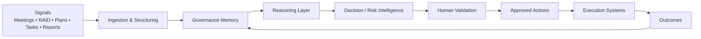

# Case Study — CORTEX

**Domain:** Enterprise AI / EPMO / Governance  
**Status:** Architecture / R&D  
**Public evidence:** Architecture documentation and portfolio artifacts only

## Problem

Enterprise governance often depends on fragmented information spread across:
- meetings,
- status reports,
- RAID logs,
- project plans,
- email,
- dashboards,
- spreadsheets,
- task systems.

The result is that leadership can receive a polished status report while important dependencies, stale risks or decision history remain hidden.

## System hypothesis

CORTEX explores whether an EPMO can become a persistent intelligence layer rather than a reporting function.

## Core design ideas

- **Governance Memory Graph** — preserve decisions, evidence, owners, dependencies and reversals.
- **Governance Shadow Graph** — reveal relationships that formal plans do not show.
- **Meeting Intelligence** — convert transcripts into structured actions, risks and decisions.
- **Operational Digital Twin** — maintain a living view of portfolio state.
- **Human validation** — consequential actions are never assumed to be autonomous.

## Why this matters

The concept is not “AI writes status reports.”

The deeper goal is:

> **Can governance remember what happened, understand why it happened, identify what is changing, and recommend what needs attention next?**

## What is real today

Related professional workflows and Microsoft 365 automation patterns exist in real delivery environments. CORTEX itself is documented as an **architecture/R&D direction**, not a deployed enterprise product.

## What remains unproven

- whether the signal quality is sufficient,
- whether dependency inference is trustworthy,
- how much structured memory is useful before noise dominates,
- whether leaders act differently when presented with this intelligence,
- governance and privacy boundaries.

## Next validation step

Build a bounded pilot around one governance workflow:

**meeting transcript → decision/action extraction → human approval → structured memory → next-meeting follow-up**

Measure:
- manual effort reduced,
- missed actions,
- decision traceability,
- false positives,
- user trust.
