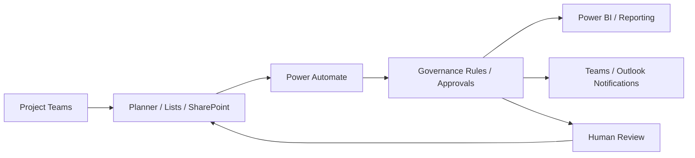

# Case Study — EPMO Microsoft 365 Automation Portfolio

**Domain:** Enterprise Automation / Governance / Analytics  
**Status:** Implemented / In Progress — Professional

> This public case study intentionally excludes employer-confidential data, internal screenshots, code, credentials and proprietary process details.

## Problem class

Enterprise PMO and EPMO functions frequently depend on:
- manual status collection,
- spreadsheet consolidation,
- duplicated project data,
- inconsistent RAID updates,
- approval bottlenecks,
- repetitive reporting,
- weak traceability between decisions and execution.

## Delivery approach

My professional work has focused on connecting existing Microsoft tools into more coherent operating systems rather than treating every automation as an isolated flow.

Typical architecture:

## Capability areas

- Power Automate,
- Power Apps,
- SharePoint,
- Microsoft Lists,
- Planner,
- Power BI,
- Excel-based reporting,
- RAID workflows,
- approvals,
- governance reminders,
- data-quality improvements,
- AI / Copilot / agent experimentation.

## Design principle

The strongest automation is not:

> “make this one task faster.”

It is:

> **“remove unnecessary handoffs, preserve governance, improve visibility, and make the system easier to operate.”**

## What is real today

These patterns are grounded in actual professional EPMO / delivery work.

This portfolio intentionally does not disclose:
- internal company data,
- architecture diagrams owned by employers,
- production URLs,
- proprietary code,
- named internal stakeholders.

## Next professional evolution

The direction is moving from:
**workflow automation → portfolio intelligence → AI-assisted governance → enterprise innovation systems.**
