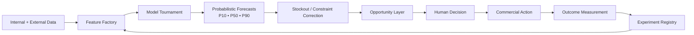

# Case Study — Retail Demand Intelligence

**Domain:** Retail Analytics / Forecasting / Decision Intelligence  
**Status:** Research / Architecture

## Problem

A demand forecast alone does not tell a retailer what action to take.

Retail demand can be distorted by:
- stockouts,
- price changes,
- promotions,
- seasonality,
- trend shifts,
- local events,
- external conditions,
- operational constraints.

A model can be statistically accurate and still be commercially weak.

## System hypothesis

Move from **forecasting demand** to **detecting actionable opportunity**.

## Research components

- **Demand Opportunity Radar**
- **Feature Factory**
- **Derived Signal Laboratory**
- **Probabilistic Forecasting**
- **Stockout-adjusted Demand**
- **Model Tournament**
- **Opportunity / Financial Layer**
- **Experiment Registry**
- **Human-in-the-loop Execution**

## Why stockouts matter

If an item sells out, observed sales can look low even though underlying demand was high.

A system that trains directly on those observations can learn the wrong lesson.

## Why probabilistic output matters

Instead of one forecast number, the architecture favors ranges such as:
- P10,
- P50,
- P90.

That keeps uncertainty visible and supports different risk tolerances.

## What is real today

This is a documented research and architecture program. It is not represented as a production forecasting platform.

## What remains unproven

- which external signals add stable predictive value,
- whether opportunity ranking improves commercial outcomes,
- whether the model is robust across categories,
- how to measure intervention causality.

## Next validation step

Start with one category and one intervention type.

Compare:
- baseline forecast,
- stockout-adjusted forecast,
- opportunity ranking,
- actual intervention outcome.

The pilot should prove decision value before expanding model complexity.
