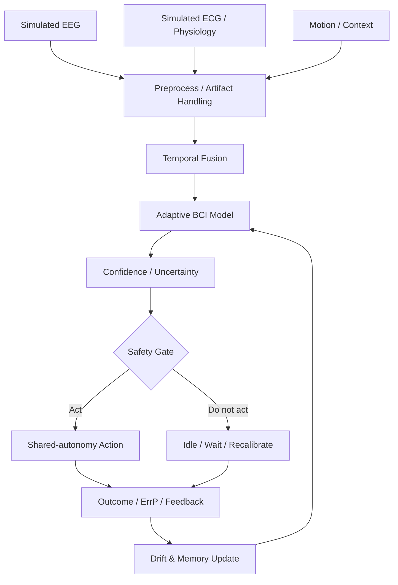

# Case Study — Wireless Brain Interface

**Domain:** Neurotechnology / Adaptive BCI / Multimodal Physiology  
**Status:** Research / Simulation  
**Project export:** Wireless Brain Interface v0.1

## Problem

Brain-computer interfaces often perform best in controlled sessions. Real-world wearables face a harder problem:

- EEG is noisy,
- electrode / device geometry changes,
- the user moves,
- physiological state changes,
- signal distributions drift,
- confidence can be poorly calibrated,
- and a false action may be more harmful than a missed action.

The project therefore focused less on maximizing a single offline accuracy score and more on **stable, uncertainty-aware behavior over time**.

## Simulation approach

We used simulated **EEG + ECG-style multimodal physiological streams** to explore how the system behaved under noise, drift, temporal misalignment, cognitive-state changes and wearable instability.

## Iterative research themes

The project went through repeated passes on:
- artifact-aware filtering,
- SNR improvement,
- drift detection,
- confidence calibration,
- false-positive and false-action reduction,
- Error-related Potential correction,
- geometry-aware adaptation,
- calibration-light latent alignment,
- multimodal temporal fusion,
- workload-aware adaptation,
- emotion-aware adaptation,
- motion-aware neuroadaptation,
- replay stabilization,
- shared autonomy,
- wearable synchronization,
- long-term personalization,
- power efficiency,
- edge deployment of EEG models.

## Key design shift

The most important conceptual shift was:

**classification confidence is not the same as permission to act.**

The architecture therefore separates:
1. decoding,
2. uncertainty estimation,
3. safety gating,
4. action.

## Maturity

This was a research/simulation project, not a clinical device. Its value is in the iterative systems reasoning around robust neuroadaptive interfaces, not a claim of medical validation.

## Next validation step

Rebuild the simulated pipeline and compare it against public real EEG/physiology datasets with metrics for:
- accuracy,
- calibration,
- false-action rate,
- drift recovery,
- latency,
- compute / power constraints.
