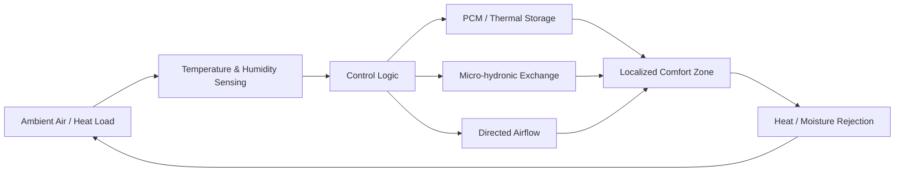

# Adaptive Personal Cooling — Thermal Flow

```mermaid
flowchart LR
    A["Ambient Air / Heat Load"] --> S["Temperature & Humidity Sensing"]
    S --> C["Control Logic"]
    C --> P["PCM / Thermal Storage"]
    C --> H["Micro-hydronic Exchange"]
    C --> F["Directed Airflow"]
    P --> Z["Localized Comfort Zone"]
    H --> Z
    F --> Z
    Z --> R["Heat / Moisture Rejection"]
    R --> A
```

The design objective is not whole-room refrigeration. It is efficient local thermal comfort.
