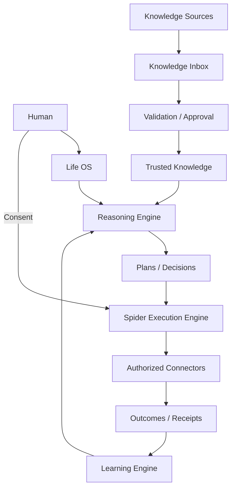

# Companion Intelligence — Life OS Architecture

```mermaid
flowchart TD
    U["Human"] --> L["Life OS"]
    K["Knowledge Sources"] --> I["Knowledge Inbox"]
    I --> V["Validation / Approval"]
    V --> T["Trusted Knowledge"]
    L --> R["Reasoning Engine"]
    T --> R
    R --> D["Plans / Decisions"]
    D --> S["Spider Execution Engine"]
    U -->|Consent| S
    S --> C["Authorized Connectors"]
    C --> O["Outcomes / Receipts"]
    O --> E["Learning Engine"]
    E --> R
```

Key boundary: information can be available to the reasoning layer without automatically granting execution permission.
