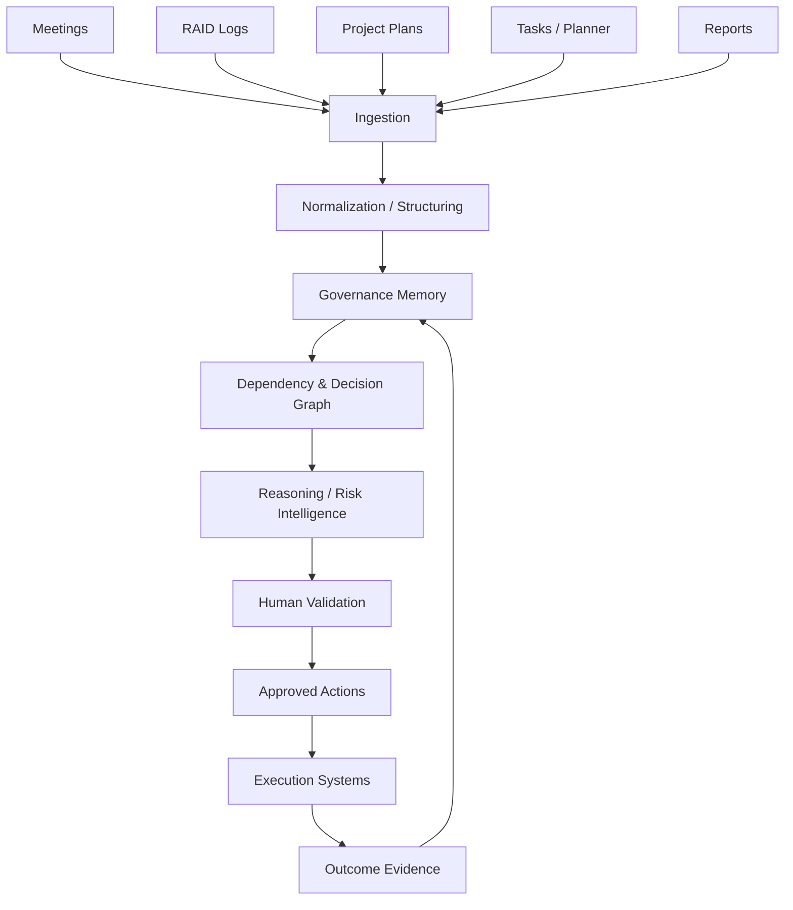

# CORTEX — Governance Intelligence Flow

```mermaid
flowchart TD
    A["Meetings"] --> I["Ingestion"]
    B["RAID Logs"] --> I
    C["Project Plans"] --> I
    D["Tasks / Planner"] --> I
    E["Reports"] --> I

    I --> N["Normalization / Structuring"]
    N --> M["Governance Memory"]
    M --> G["Dependency & Decision Graph"]
    G --> R["Reasoning / Risk Intelligence"]
    R --> H["Human Validation"]
    H --> X["Approved Actions"]
    X --> T["Execution Systems"]
    T --> O["Outcome Evidence"]
    O --> M
```

The loop is intentionally human-governed. Intelligence can recommend, but consequential actions remain reviewable.
