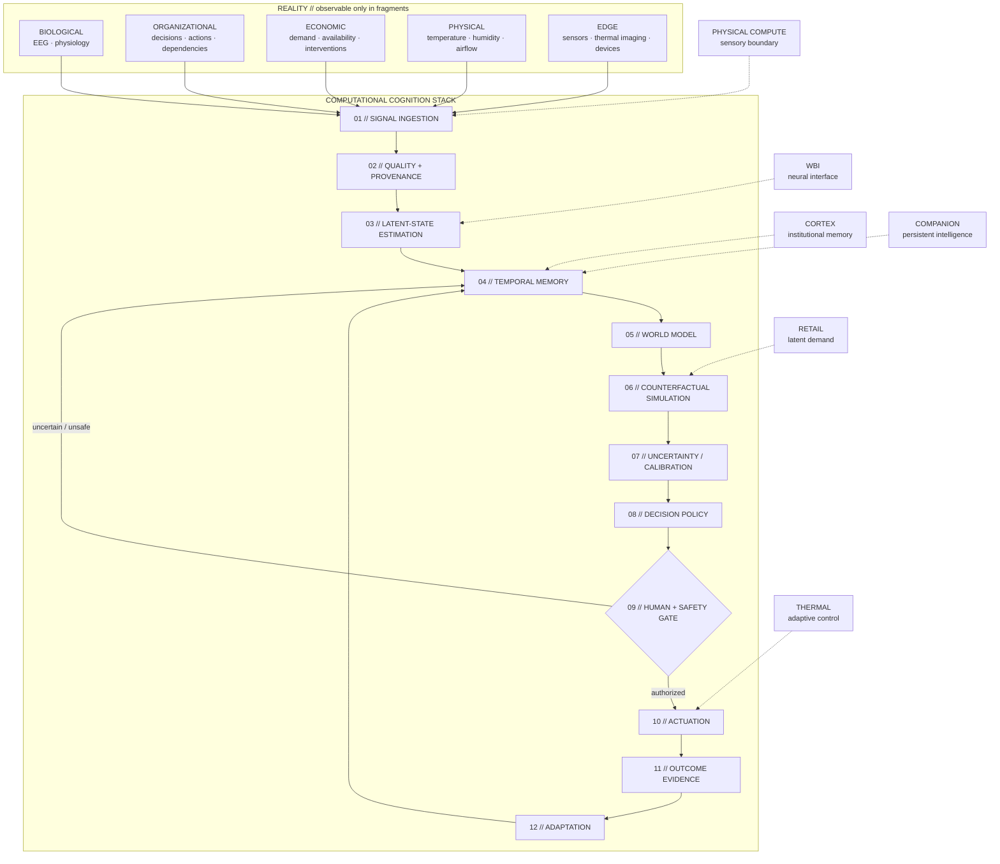

# INTELLIGENCE TOPOLOGY

`// CROSS-DOMAIN SYSTEM MAP`

This is not a map of industries. It is a map of **computational boundaries**.

The projects below operate on different substrates — neural signals, organizations, markets, human microclimates and physical sensors — but repeatedly require the same machinery: infer hidden state from incomplete observations, preserve temporal context, reason under uncertainty, constrain action and learn from consequences.



## `// WHY THE LOOP EXISTS`

A conventional program receives an input and returns an output.

These systems are harder because the state that matters is often **not directly observable**.

A BCI cannot directly observe intent.  
A retailer cannot directly observe demand suppressed by unavailability.  
CORTEX cannot directly observe organizational truth from one sentence.  
A thermal controller cannot infer human comfort from room temperature alone.

The architecture therefore treats observation as evidence rather than truth.

```text
OBSERVATION != STATE
PREDICTION  != CERTAINTY
DECISION    != AUTHORIZATION
ACTION      != SUCCESS
```

Outcome evidence closes the loop.

---

## `// PROJECT ↔ STACK INTERFACE`

| Thread | Primary boundary | Core technical problem | Evidence boundary |
|---|---|---|---|
| **CORTEX** | Organization ↔ memory | provenance, decision lineage, correction, bounded extraction | Synthetic benchmark; Architecture / R&D |
| **Wireless Brain Interface** | Biology ↔ machine | drift, calibration, abstention, false-action control | Research / Simulation |
| **Companion Intelligence** | Human ↔ persistent software | temporal memory, evidence lineage, bounded agency | In Progress; public implementation limited |
| **Adaptive Personal Cooling** | Human ↔ environment | microclimate sensing, control, energy and condensation | Prototype / R&D; bench measurements pending |
| **Retail Demand Intelligence** | Observation ↔ latent demand | censoring, forecasting, uncertainty, intervention logic | Research / Architecture |
| **Physical Compute** | Reality ↔ software | sensing, synchronization, edge instrumentation | Hardware / IoT exploration |

---

## `// CONVERGENCE HYPOTHESIS`

The long-term research question is not whether these projects can be merged into one giant application.

It is whether their reusable primitives can become a coherent **adaptive-systems substrate**:

```text
sensory boundary
    + provenance
    + temporal memory
    + latent-state inference
    + counterfactual simulation
    + calibrated uncertainty
    + reversible / authorized action
    + outcome telemetry
    + adaptation
```

If a primitive cannot survive evidence from its own domain, it does not earn convergence merely because the architecture looks elegant.

**Architecture proposes. Evidence selects. Reality gets the final commit.**

---

[← Return to the intelligence lab](../README.md) · [Evidence-gated roadmap →](../PORTFOLIO_ROADMAP.md)
