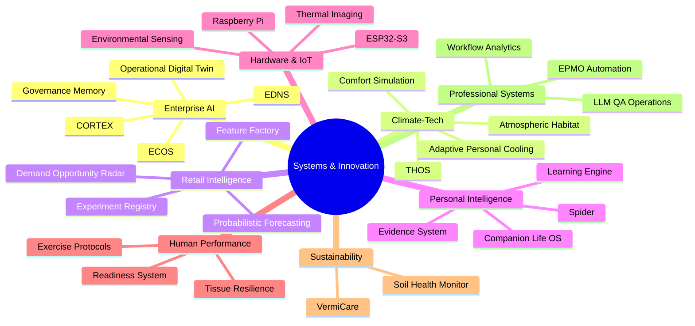
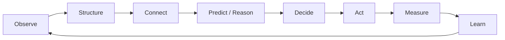

# Portfolio System Map

This diagram shows the relationship between the major project families.

```mermaid
mindmap
  root((Systems & Innovation))
    Enterprise AI
      CORTEX
      EDNS
      ECOS
      Governance Memory
      Operational Digital Twin
    Climate-Tech
      Adaptive Personal Cooling
      THOS
      Atmospheric Habitat
      Comfort Simulation
    Retail Intelligence
      Demand Opportunity Radar
      Feature Factory
      Probabilistic Forecasting
      Experiment Registry
    Personal Intelligence
      Companion Life OS
      Spider
      Evidence System
      Learning Engine
    Hardware & IoT
      Raspberry Pi
      ESP32-S3
      Environmental Sensing
      Thermal Imaging
    Human Performance
      Tissue Resilience
      Exercise Protocols
      Readiness System
    Sustainability
      VermiCare
      Soil Health Monitor
    Professional Systems
      EPMO Automation
      LLM QA Operations
      Workflow Analytics
```

## Common architecture pattern

Across domains, the recurring architecture is:

```mermaid
flowchart LR
    O["Observe"] --> S["Structure"]
    S --> C["Connect"]
    C --> P["Predict / Reason"]
    P --> D["Decide"]
    D --> A["Act"]
    A --> M["Measure"]
    M --> L["Learn"]
    L --> O
```
