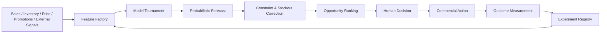

# Retail Intelligence — Decision Loop

```mermaid
flowchart LR
    A["Sales / Inventory / Price / Promotions / External Signals"] --> F["Feature Factory"]
    F --> M["Model Tournament"]
    M --> P["Probabilistic Forecast"]
    P --> C["Constraint & Stockout Correction"]
    C --> O["Opportunity Ranking"]
    O --> H["Human Decision"]
    H --> X["Commercial Action"]
    X --> R["Outcome Measurement"]
    R --> E["Experiment Registry"]
    E --> F
```

The goal is to connect prediction to measurable commercial action instead of stopping at a forecast.
