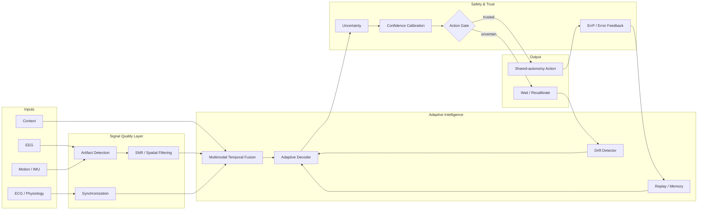

# Wireless Brain Interface — Neuroadaptive Architecture

```mermaid
flowchart LR
    subgraph Inputs
      EEG["EEG"]
      ECG["ECG / Physiology"]
      IMU["Motion / IMU"]
      CTX["Context"]
    end

    subgraph SignalLayer["Signal Quality Layer"]
      ART["Artifact Detection"]
      SNR["SNR / Spatial Filtering"]
      SYNC["Synchronization"]
    end

    subgraph Intelligence["Adaptive Intelligence"]
      FUS["Multimodal Temporal Fusion"]
      DEC["Adaptive Decoder"]
      DRIFT["Drift Detector"]
      MEM["Replay / Memory"]
    end

    subgraph Safety["Safety & Trust"]
      UNC["Uncertainty"]
      CAL["Confidence Calibration"]
      ERR["ErrP / Error Feedback"]
      GATE{"Action Gate"}
    end

    subgraph Output
      ACT["Shared-autonomy Action"]
      WAIT["Wait / Recalibrate"]
    end

    EEG --> ART
    ECG --> SYNC
    IMU --> ART
    CTX --> FUS
    ART --> SNR --> FUS
    SYNC --> FUS
    FUS --> DEC
    DEC --> UNC --> CAL --> GATE
    DRIFT --> DEC
    MEM --> DEC
    GATE -->|trusted| ACT
    GATE -->|uncertain| WAIT
    ACT --> ERR --> MEM
    WAIT --> DRIFT
```

Design principle: **the decoder proposes; the safety layer decides whether the system is allowed to act.**
