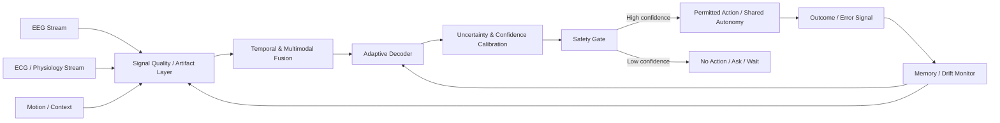

# Wireless Brain Interface

**Status:** Research / Simulation / Prototype Architecture  
**Version recovered:** v0.1 project export  
**Domain:** Neurotechnology / Brain-Computer Interfaces / Multimodal Physiological Computing

The Wireless Brain Interface project explored whether a non-invasive adaptive interface could remain useful outside clean laboratory conditions—where EEG quality changes, the wearer moves, physiology drifts, devices shift, confidence varies and false actions can become more important than raw classification accuracy.

## Core research question

> **Can a wearable brain-computer interface adapt to a changing human and changing sensor conditions while staying calibrated, conservative and safe enough to avoid unwanted actions?**

## Simulation work

A major part of the project used **simulated EEG and ECG-style physiological signals** to stress-test the architecture before relying on real hardware.

The simulation stream explored conditions such as:
- noisy or low-SNR EEG,
- temporal misalignment between modalities,
- motion / artifact contamination,
- physiological drift,
- session-to-session distribution shift,
- idle states where no action should occur,
- confidence degradation,
- changing cognitive workload,
- changing emotional / physiological context,
- synchronization problems in wearable multimodal sensing.

The goal was not medical diagnosis. It was to test how a neuroadaptive control system might behave when the input signals are imperfect and dynamic.

## Architecture

## Research workstreams

### Signal quality & robustness
- artifact-aware adaptive filtering,
- SNR-focused EEG enhancement,
- spatial filtering,
- motion-artifact reduction,
- cross-device robustness.

### Adaptation & personalization
- drift detection,
- drift-aware adaptation,
- trust-gated adaptation,
- reversible adaptation,
- memory-management strategies,
- calibration-light latent alignment,
- long-term personalization.

### Safety & false-action control
- confidence calibration,
- uncertainty detection,
- idle-state false-positive reduction,
- false-action reduction,
- Error-related Potential (ErrP) correction,
- shared-autonomy strategies.

### Multimodal neuroadaptation
- EEG + ECG / physiology fusion,
- temporal fusion,
- cognitive-workload awareness,
- emotion-aware adaptation,
- motion-aware neuroadaptation,
- context-aware companion behavior.

### Wearable / edge deployment
- wearable synchronization and stability,
- long-duration use,
- power-efficiency research,
- EEG foundation-model edge deployment,
- real-world adaptive decoding.

## Why the project mattered

A conventional BCI benchmark often asks:

> “How accurate is the classifier?”

This project increasingly asked a different question:

> **“When should the system trust itself enough to act?”**

That shifts the architecture toward uncertainty, calibration, adaptation, false-action control and human-machine shared autonomy.

## What is real

Recovered project history confirms a sustained research program across April–May 2026 with many iterative workstreams around adaptive EEG/BCI reliability, safety, multimodal fusion and wearable deployment. The project was later exported as **Wireless Brain Interface v0.1**.

## What is not claimed

- It is not presented as a clinical or diagnostic system.
- No medical efficacy is claimed.
- Simulation results are not presented as evidence of real-world neurological performance.
- A production wearable BCI was not validated from this work.

## Next rigorous validation path

1. Reconstruct the simulation notebooks and synthetic-signal generator.
2. Add public EEG datasets and synchronized ECG/physiology datasets where appropriate.
3. Benchmark baseline decoder vs. adaptive decoder.
4. Measure not only accuracy but:
   - calibration error,
   - false-action rate,
   - idle-state precision,
   - drift recovery,
   - latency,
   - power / compute budget.
5. Validate multimodal fusion under deliberate desynchronization and artifact injection.
6. Only then move toward hardware-in-the-loop experiments.

## Reproducible public-data benchmark protocol

The first evidence gate is tracked in **GitHub Issue #1**. The evaluation order is intentionally staged so increasingly realistic evidence is added without confusing simulation with real-world validation.

### Stage A — deterministic smoke test
Use fixed-seed synthetic EEG/physiology-like signals to verify preprocessing, confidence calibration, abstention/safety gating, metric calculation and machine-readable result generation. This stage validates the experiment machinery, not BCI performance.

### Stage B — PhysioNet EEG Motor Movement/Imagery
Use the public EEG Motor Movement/Imagery dataset as the first real-EEG benchmark. Its motor tasks and explicit rest annotations allow the project to measure false activation during idle/rest directly rather than treating classifier accuracy as a safety proxy.

Primary comparison:
1. conventional decoder,
2. calibrated decoder/threshold baseline,
3. uncertainty-calibrated decoder with a separate permission-to-act gate.

The central question is whether gating reduces false actions without an unacceptable loss of useful actions.

### Stage C — standardized MOABB evaluation
Use MOABB-compatible evaluation where appropriate so preprocessing/evaluation choices can be compared through an established reproducibility framework rather than a bespoke benchmark alone. Record the exact MOABB and dependency versions used by every published run.

### Stage D — longitudinal drift/adaptation
Use a multi-session dataset such as Kumar2024 through MOABB to test recalibration/domain adaptation and drift recovery across sessions. This is a stronger test of adaptation than relying only on artificial perturbations of a single recording.

### Benchmark registry fields

| Field | Required value |
|---|---|
| Dataset + version/access date | TBD until run |
| Subject/session scope | TBD until run |
| Evaluation paradigm | TBD until run |
| Preprocessing | TBD until run |
| Baseline decoder | TBD until run |
| Calibration method | TBD until run |
| Action-gate rule | TBD until run |
| Seed/config manifest | TBD until run |
| Accuracy / balanced accuracy | TBD |
| Calibration error | TBD |
| Rest/idle false-action rate | TBD |
| Idle precision / abstention | TBD |
| Useful-action retention | TBD |
| Drift recovery | TBD |
| Inference latency | TBD |
| Compute footprint | TBD |
| Hardware power | TBD unless physically measured |
| Run date | TBD |

### Prior-art positioning

Adaptive decoding, recalibration and domain adaptation are established BCI research areas. The project should therefore **not** claim novelty merely from being adaptive or calibration-light. The narrower research contribution to test is whether explicit uncertainty calibration, a distinct permission-to-act boundary and drift-aware adaptation produce safer behavior than simpler calibrated/adaptive baselines.

Prior-art review here is technical awareness only; it is not a patentability or freedom-to-operate opinion.

### Decision rule

Advance only on measured, reproducible evidence. If the separate action gate does not materially reduce false actions after accounting for lost useful actions—or if the architecture reduces to an established simpler method—the project should be simplified or reframed rather than defended.
